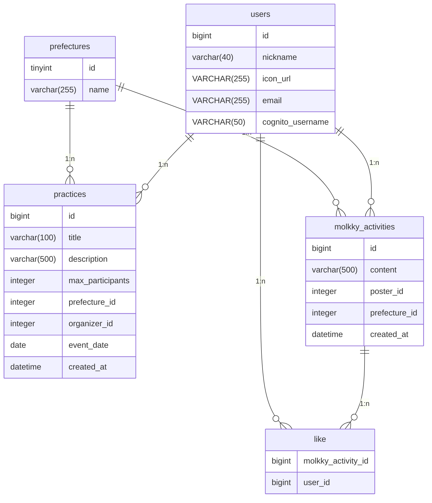

# モルク
## 環境構築手順
1. .envを作成
* .env.local（場所：docker > db 配下）
  * MYSQL_DATABASE
  * MYSQL_ROOT_PASSWORD
  * MYSQL_USER
  * MYSQL_PASSWORD
* .env.local（場所：nuxt 配下）
  * NUXT_PUBLIC_FB_API_KEY
  * NUXT_PUBLIC_FB_AUTH_DOMAIN
  * NUXT_PUBLIC_FB_PROJECT_ID
  * NUXT_PUBLIC_FB_STORAGE_BUCKET
  * NUXT_PUBLIC_FB_MESSAGING_SENDER_ID
  * NUXT_PUBLIC_FB_APP_ID
  * NUXT_PUBLIC_FB_MEASUREMENT_ID

## UI設計
figma
https://www.figma.com/file/r882IZ0EDyNOmAsc9xah5A/%E3%83%A2%E3%83%AB%E3%82%AFUI%E8%A8%AD%E8%A8%88?type=design&node-id=5-2&mode=design&t=7jTxUseyYZ86HPTQ-0

## DB設計

