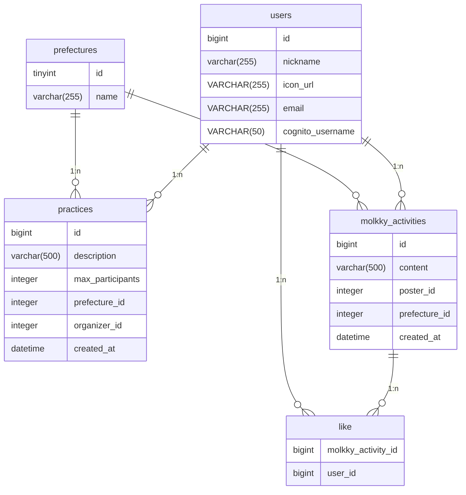

# モルク

## DB設計

```mermaid
erDiagram

users ||--o{ practices: "1:n"
prefectures ||--o{ practices: "1:n"
users ||--o{ molkky_activities: "1:n"
prefectures ||--o{ molkky_activities: "1:n"
molkky_activities ||--o{ like: "1:n"
users ||--o{ like: "1:n"

users {
  bigint id
  varchar(255) nickname
  VARCHAR(255) icon_url
  VARCHAR(255) email
  VARCHAR(50) cognito_username
}

practices {
  bigint id
  varchar(500) description
  integer max_participants
  integer prefecture_id
  integer organizer_id
  datetime created_at
}

molkky_activities {
  bigint id
  varchar(500) content
  integer poster_id
  integer prefecture_id
  datetime created_at
}

like {
  bigint molkky_activity_id
  bigint user_id
}

prefectures {
  tinyint id
  varchar(255) name
}
```
