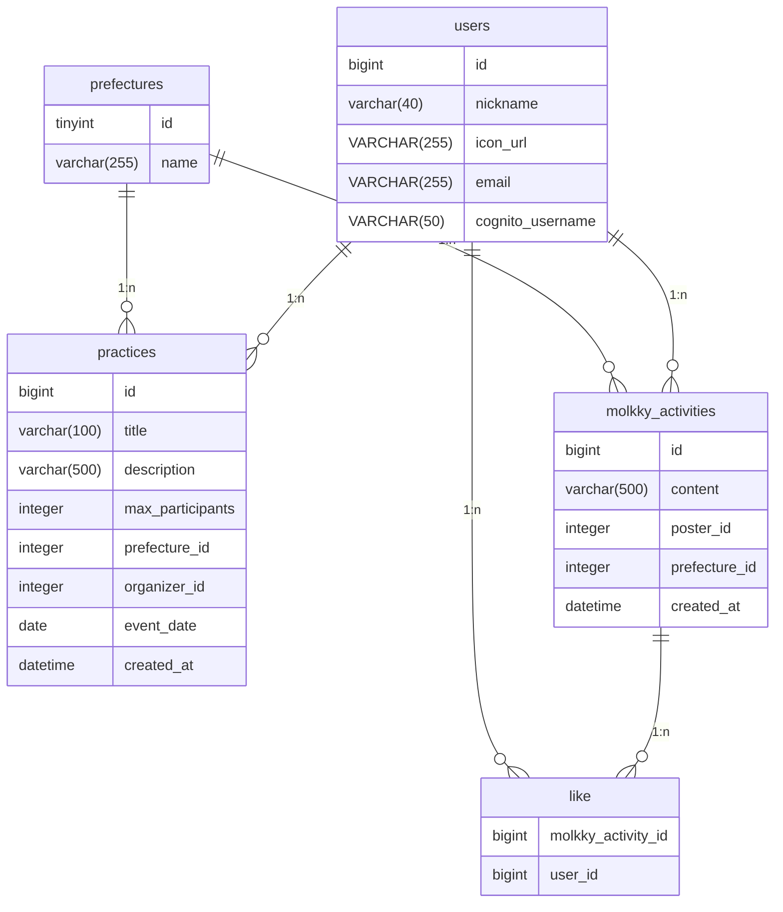

# モルク

## UI設計
figma
https://www.figma.com/file/r882IZ0EDyNOmAsc9xah5A/%E3%83%A2%E3%83%AB%E3%82%AFUI%E8%A8%AD%E8%A8%88?type=design&node-id=5-2&mode=design&t=7jTxUseyYZ86HPTQ-0

## DB設計

```mermaid
erDiagram

users ||--o{ practices: "1:n"
prefectures ||--o{ practices: "1:n"
users ||--o{ molkky_activities: "1:n"
prefectures ||--o{ molkky_activities: "1:n"
molkky_activities ||--o{ like: "1:n"
users ||--o{ like: "1:n"

users {
  bigint id
  varchar(40) nickname
  VARCHAR(255) icon_url
  VARCHAR(255) email
  VARCHAR(50) cognito_username
}

practices {
  bigint id
  varchar(100) title
  varchar(500) description
  integer max_participants
  integer prefecture_id
  integer organizer_id
  date event_date
  datetime created_at
}

molkky_activities {
  bigint id
  varchar(500) content
  integer poster_id
  integer prefecture_id
  datetime created_at
}

like {
  bigint molkky_activity_id
  bigint user_id
}

prefectures {
  tinyint id
  varchar(255) name
}
```
